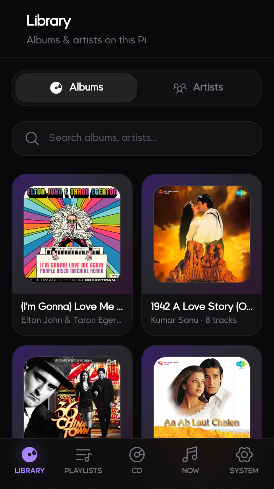

# Music Player

A Raspberry Pi friendly music player app with a React frontend and Node.js backend.

## Install on Raspberry Pi

```bash
git clone git@github.com:cksjava/music-player.git
cd music-player
chmod +x 01.sh 02.sh configure-iqaudio-audio.sh
./01.sh
./02.sh
./configure-iqaudio-audio.sh
sudo reboot
```

After reboot, the app is configured to start automatically.

## Access from mobile devices

1. Connect your phone and Raspberry Pi to the **same local network** (same Wi-Fi/LAN).
2. Open a browser on the phone and go to:

```text
http://musicboxpi.local:3847
```

If `.local` does not resolve on your network/client, use the Pi's LAN IP instead:

```text
http://<raspberry-pi-ip>:3847
```

## Assumptions

- Primary audio output HAT is **IQaudIO**.
- Library audio files are expected to be mostly **M4A** or **FLAC**.

## Audio Device Auto-Detection

`configure-iqaudio-audio.sh` detects IQaudIO-like ALSA cards and chooses a matching mpv
`audio-device` value. It then:

- sets `/etc/asound.conf` so IQaudIO is the default system playback device
- writes app audio variables into `.env`:
  - `MPV_AO`
  - `MPV_AUDIO_DEVICE`
  - `IQAUDIO_ALSA_CARD_INDEX`
  - `IQAUDIO_ALSA_CARD_ID`

The backend loads `.env` via dotenv on startup.

## Screenshot


